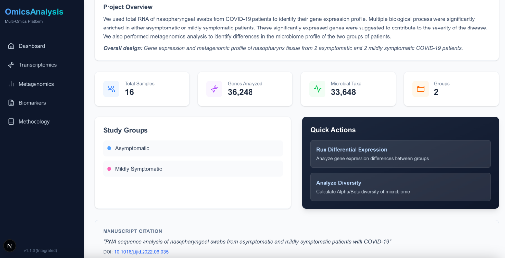
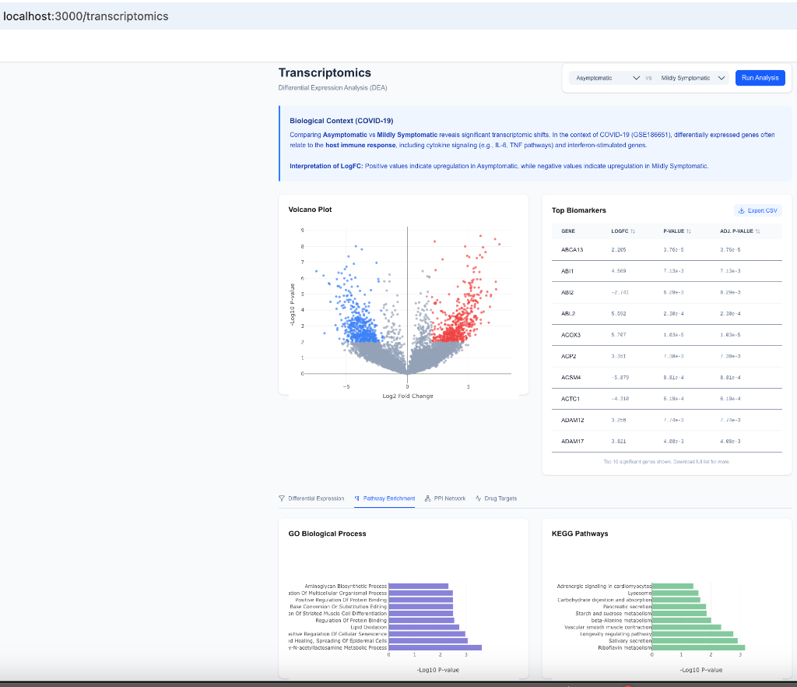
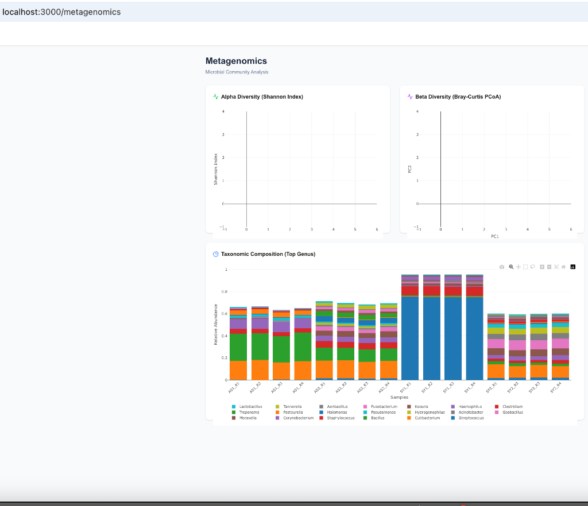
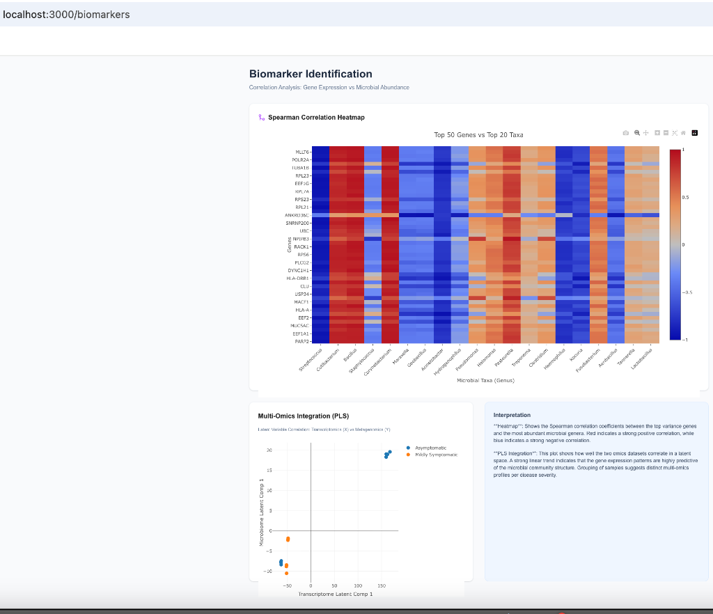

# Multi-Omics Data Analysis Platform

A comprehensive platform for analyzing and visualizing multi-omics data (Transcriptomics and Metagenomics) from the European Nucleotide Archive (PRJNA774978).



## Features

### 🧬 Transcriptomics Analysis
- **Differential Gene Expression**: Compare transcriptomic profiles between asymptomatic and mildly symptomatic patients.
- **Pathway Enrichment**: Identify over-represented biological pathways using Enrichr (GO/KEGG).
- **Network Analysis**: Protein-Protein Interaction (PPI) networks via STRING DB.
- **Drug Discovery**: Query drug-gene interactions via DGIdb.
- **Visualizations**: Interactive Volcano Plots and detailed results tables.



### 🦠 Metagenomics Analysis
- **Community Composition**: Visualize taxonomic abundance (Genus level) across samples.
- **Alpha Diversity**: Calculate and compare Shannon diversity indices between groups.
- **Beta Diversity**: Bray-Curtis PCoA for community structure similarity.



### 📊 Biomarker Discovery
- **Correlation Analysis**: Spearman correlation between gene expression and microbial abundance.
- **Multi-Omics Integration**: Partial Least Squares (PLS) integration to find latent relationships.



## Tech Stack
- **Backend**: Python, FastAPI, Pandas, SciPy, Scikit-learn.
- **Frontend**: TypeScript, Next.js, Tailwind CSS, Plotly.js, Lucide React.

## Getting Started

### Prerequisites
- Python 3.8+
- Node.js 18+

### Installation & Running

1. **Setup Backend**
   ```bash
   cd backend
   python3 -m venv venv
   source venv/bin/activate
   pip install -r requirements.txt
   # Start the API
   uvicorn main:app --reload
   ```

2. **Setup Frontend**
   ```bash
   cd frontend
   npm install
   # Start the UI
   npm run dev
   ```

3. **Open Application**
   Navigate to [http://localhost:3000](http://localhost:3000) in your browser.

## Data Source
Data derived from [PRJNA774978](https://www.ebi.ac.uk/ena/browser/view/PRJNA774978), utilizing processed count files for gene expression and metagenomic abundance.
